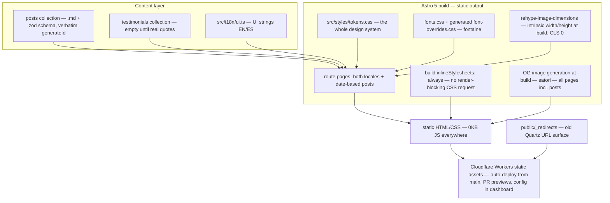

# System architecture

## Overview

Static site, no application server. Content lives in Astro Content Collections validated by zod schemas; the build emits plain HTML/CSS with **0KB JavaScript on every page** (no islands have shipped). **State: Sessions 1–8.** Session 7 collapsed the site to 8 pages (home absorbing `/principles/`, ideas, about, contact, both locales); Session 8 (branch `migration/quartz-import`) migrated all 10 published i.usedtocode.com posts plus 9 English translations — the build is 28 pages. OG generation (satori) is built and covers every page including posts. (The Bottleneck signature element shipped in session 3 and was removed the same day at Aníbal's call — archived: [[signature-element-bottleneck]].)

## Module graph

## Information architecture

Routes (EN default at `/`, ES mirror under `/es/` — [[en-default-locale]]):

- `/` and `/es/` — homepage
- `/ideas/` ↔ `/es/ideas/` — typeset post index per locale
- `/YYYY/MM/DD/slug/` — every post, BOTH locales, no `/es/` prefix ([[blog-url-migration]]); slug = filename stem verbatim; date parts are UTC (`postDateParts`)
- `/about/` ↔ `/es/sobre-mi/`; `/contact/` ↔ `/es/contacto/`
- `/404` page; `/rss.xml` + `/es/rss.xml`; `/sitemap-index.xml` (post hreflang via serialize hook); `/og/...png` per page
- `public/_redirects` maps the entire old i.usedtocode.com surface (folder pages, tags, .html twins, /index.xml, OG webp, drafts)

Locale switcher persists the equivalent page (`localizedRoutes` map + prefix swap in `src/i18n/utils.ts`); posts bypass it with explicit `alternates` (translation or the other locale's index — never a 404). The site serves on **i.usedtocode.com** ([[domain-i-usedtocode]]); the archive link is gone because the archive lives here now.

## Constraints

- Static output; **0KB JS on all pages** today; islands only if one ever earns its place ([[astro-5-static-islands]], [[performance-as-design-feature]]).
- One design-tokens file is the entire styling system; no Tailwind ([[vanilla-css-design-tokens]]).
- Fonts: `optional` + metric-matched fallbacks + selective preload — do not revert to `swap` ([[font-loading-strategy]]); Lighthouse CI uses devtools throttling ([[lhci-devtools-throttling]]).
- Publishing a post = adding one .md file and pushing — no other steps. Post images: root-absolute paths under `public/`, dimensions injected at build (missing file fails the build).
- Post URLs are load-bearing SEO surface — see the three invariants in [[blog-url-migration]] before touching anything in the date→URL path.
- Testimonials section renders only with ≥3 real quotes ([[testimonials-real-or-omitted]]).
