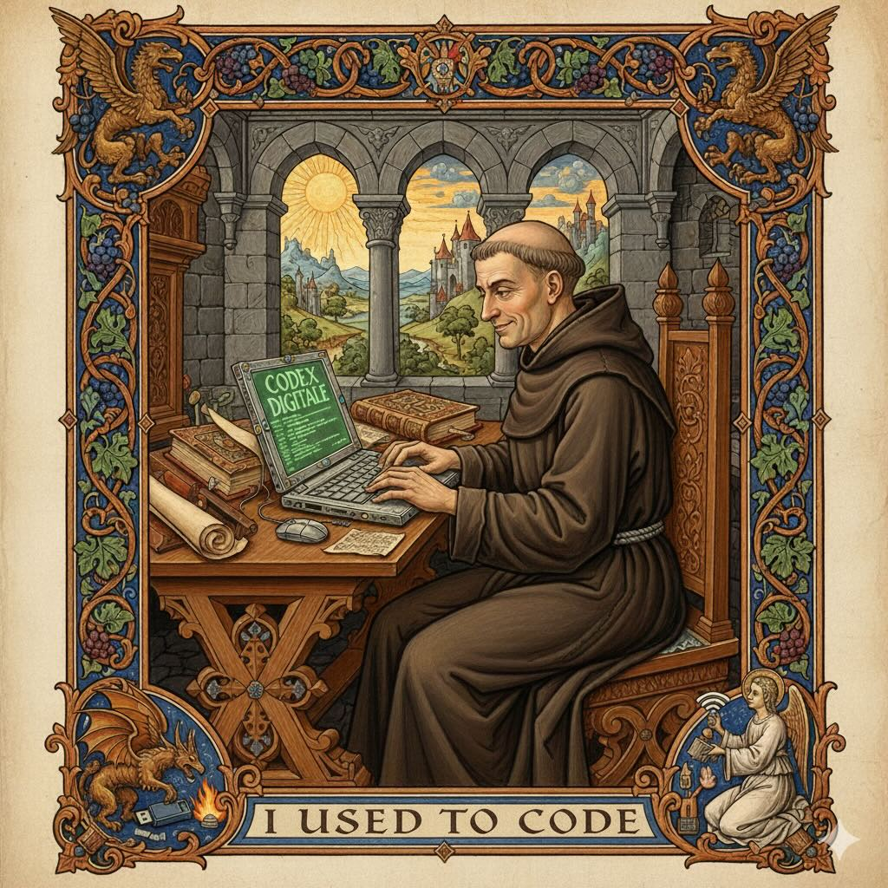

  
  

Mi nombre es Aníbal Rojas, hace muchos años yo solía programar, en Java hasta que me cansé de los XMLs push-ups del momento, luego en Ruby que sigo considerando el lenguaje de programación más bonito del mundo. Luego me "sucedió" el management como a muchos otros desarrolladores, y después de sufrir un burn-out horrendo en el proceso de transición de individual contributor (IC) a manager, resultó que fui muy bueno en eso de ser manager.

Me dediqué al management muchos años, una y otra vez lideré equipos y los ayudé a elevar su nivel, a enfrentar desafíos complejos, cada vez más grandes. Tuve la suerte de siempre estar involucrado en proyectos con tecnología de punta, desde muy temprano la propia web, y luego cloud computing fueron parte de mi día a día. Trabajé con grandes empresas, oil and gas, telco, aviación, etc y trabajé con startups, mundos completamente aparte.

En mi último trabajo fui Vicepresidente de Ingeniería de la startup de educación en línea más importante de Latinoamérica por seis años, Platzi, un trabajo retador, complejo, demandante y al que siempre recordaré porque nunca un trabajo me permitió darle una oportunidad de crecer a tanta gente; las personas de mi equipo, y sobre todo nuestros estudiantes. 

En el 2025 me tomé un sabático, a mis 56 años, prioricé la "deuda técnica" de salud, y en el tiempo restante me dediqué a explorar en profundidad el desarrollo de software apoyado en el marco de Inteligencia Artificial Generativa. Ya yo me había metido de lleno a entender los principios fundamentales de IA Generativa desde el  lanzamiento de ChatGPT por parte de OpenAI el 20 de Noviembre del 2022, pero aquí me metí hasta los codos en el barro.

No solo probé montones de "Asistentes de Programación" (Coding Assistants), realmente no sé cómo llamarlos,  sino que además me dediqué a desafiar muchas de las ideas que yo mismo tenía acerca de qué significaba desarrollar, mantener, gestionar una aplicación y en particular esa mítica tarea en el núcleo del desarrollo de software: *programar*.

Hoy en día estoy enfocado en explorar las posibilidades, compromisos y límites de sistemas de agentes en generación de software, mi *weapon-of-choice* es Claude Code porque me permite jugar con un *agentic harness* de una forma muy sencilla y potente. Confieso que ha sido un proceso absorbente y divertido pero no exento de frustración, y extremadamente demandante.

¿Qué cómo te suscribes a mis newsletter, o me sigues o favoriteas? Eso no es aquí, esto es un website vieja escuela, HTML y CSS. En esta época de IA Generativa y Redes Sociales he encontrado refugio en el hecho de escribir como un desafío que me ayuda a pensar, a darle forma a mis ideas y este sitio me permite convertir ese desafío en algo posiblemente útil.

Mi plan es compartir lo que escribo aquí en mi [LinkedIn](https://www.linkedin.com/in/anibalrojas), que es como la comida de hospital 😬, en el basurero en llamas que es [X (Twitter)](https://x.com/anibal), en [Substack](https://anibal.substack.com/) y ahí si quieres me sigues y hablamos.

## Principios Fundamentales para trabajar con Asistentes de Programación 

Es una serie de cinco artículos para desarrolladores de software escépticos, decepcionados o frustrados por la IA Generativa; y para los líderes y managers explorando el impacto de estas tecnologías en sus equipos y procesos:

1. [La Alucinación es el Feature Fundamental de los LLMs](/2025/10/20/la-alucinacion-es-el-feature-fundamental-de-los-llms)
2. [Las matemáticas del Código Asistido por IA](/2025/10/28/las-matematicas-del-codigo-asistido-por-ia)
3. [Una Visión de Sistemas para la Programación Asistida por IA](/2025/11/03/una-vision-de-sistemas-para-la-programacion-asistida-por-ia)
4. [Steering - Favoreciendo las Alucinaciones Positivas en los Asistentes de Programación](/2025/11/06/steering-favoreciendo-las-alucinaciones-positivas)
5. TBD